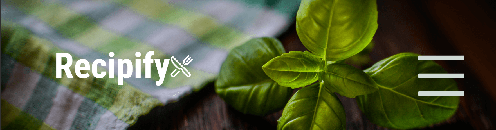
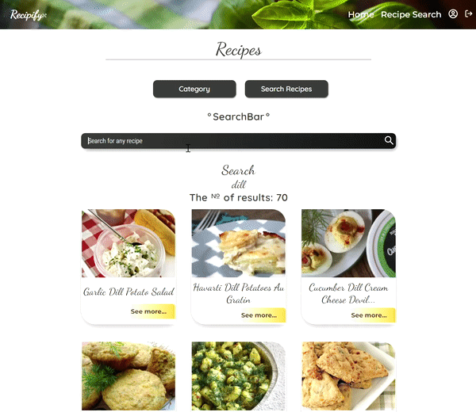

# 🍃 Welcome to the page! 

<h4>_°This project has been designed as my final assignment for 💫NOVI Hogeschool 2022!°_</h3>
The name of the application is: 

##### The application was designed with the purpose of taking off the burden of people's shoulders and giving them a simple answer to the all-times-popular :
><h1 style="color:white; font-family: 'Monotype Corsiva' ">"What are we eating today?"</h1>

***
## Table of content: 
* [Structure](#structure)
* [Preview](#preview)
* [Installation](#installation)
* [Functionality](#functionality)
* [Creative Usage Acknowledgement](#creative-usage-acknowledgement)
***
## Structure
This webapplication was built with:
- React;
- Spoonacular API;
- Hogeschool NOVI Backend; 
- and a bit of enthusiasm. 

#### The application consists of the following pages:
- Home;
- Sign In with a Register subpage;
- Not Found Page

#### After a user signs in the availiable pages are:
- Home;
- Recipe Search with subpages:

  * Search,
  * Category,
- Profile;
- \+ Log out button.

### Preview 
This a  Recipe Search Page: 

The Register Page: 

***
## Installation
Once you  copy the application on your device, you are to do the following:
1. Install the node modules by running 

`npm install`

2. To start the application, you need to type 

`npm start`

3. Open [http://localhost:3000]( http://localhost:3000) to view it in your browser.

As the application is making use of a <a style="color:#8967F7" href="https://spoonacular.com/food-api">Spoonacular API</a>, the user would need to :
1. go to the website and make an account to get an **_api key_** (using only your email);
2. save the api Key in the .env file. as a 

`REACT_APP_API_KEY ` 

***
## Functionality

#### The application is easy to use, but to be able to make use of the services, one would need to **_register_**, which can be done with:
- _email_;
- _and some imagination for password and name_.

To _**log in**_ you would only need to enter your name and password.

Once you are logged in, you are able to:
- search recipes by the name or ingredient;
- choose from food categories( you can choose dessert or main dish, or breakfast);
- get random recipes to get you started;
- check the nutritional value of the dish;
- get the shopping list with the aisle enumeration;
- get the instructions list to make cooking even easier.
***

## 💫Creative usage acknowledgement: 

These are the  images that have been used in the web application:

৹ <a style="color:#8967F7" href="https://www.flaticon.com/free-icons/welcome">
Welcome icons created by Freepik - Flaticon</a>;

৹ <a style="color:#8967F7" href="https://www.flaticon.com/free-icons/food-and-restaurant">
Food and restaurant icons created by Pixel perfect - Flaticon</a>;

৹ <a style="color:#8967F7" href="https://www.flaticon.com/free-icons/cook">
Cook icons created by bqlqn - Flaticon</a>;

৹ <a style="color:#8967F7" href="https://www.flaticon.com/free-icons/account">
Account icons created by srip - Flaticon</a>;

৹ <a style="color:#8967F7" style="color:#8967F7" href="https://www.flaticon.com/free-icons/home">
Home icons created by Freepik - Flaticon</a>;

৹ <a style="color:#8967F7" href="https://www.flaticon.com/free-icons/salad">
Salad icons created by mynamepong - Flaticon</a>;

৹ <a style="color:#8967F7" href="https://pngtree.com/so/crying">
Crying png from pngtree.com</a>;

৹ <a style="color:#8967F7" href="https://www.flaticon.com/free-icons/error">
Error icons created by Freepik - Flaticon</a>.

✓ I also have made use of the <a style="color:#8967F7" href="https://react-icons.github.io/react-icons/">react icons</a>. If you are interested in it, you can just install a package with 

`npm install react-icons --save `.

***